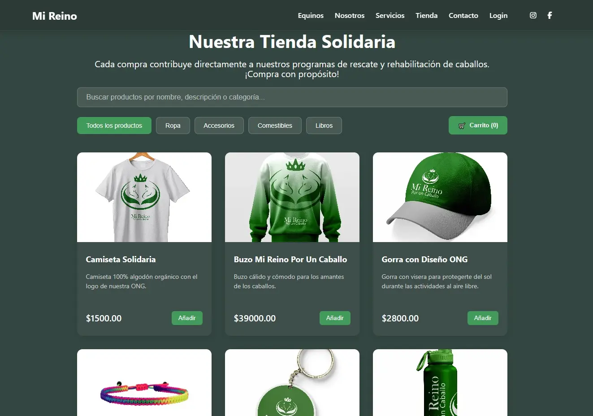

# 🐎 Mi Reino Por Un Caballo - Ecommerce Solidario



**Plataforma de comercio electrónico para apoyar el rescate y rehabilitación de caballos**

## 📌 Descripción del Proyecto
Ecommerce con propósito social que convierte compras en ayuda directa para caballos maltratados. Desarrollado con React y Vite, combina funcionalidades comerciales con transparencia en impacto social.

---

## 🛠 Stack Tecnológico

### Frontend Principal
- **React 18** (Hooks + Context API)
- **Vite 4** (Build Tool)
- **React Router v6** (Navegación)
- **CSS Modules** (Estilos encapsulados)

### Persistencia
- **LocalStorage** (Carrito de compras)
- **Mock API** (Datos iniciales)

### Próximas Integraciones
- **Firebase** (Autenticación)
- **MercadoPago API** (Pasarela de pagos)

---

## 🌟 Características Actuales

### 🛒 Núcleo Ecommerce
| Función                | Estado       | Detalle                          |
|------------------------|--------------|----------------------------------|
| Catálogo interactivo   | ✅ Producción| Filtros por categorías y precios |
| Gestión de carrito     | ✅ Producción| Persistencia en localStorage     |
| Vista de producto      | ✅ Producción| Galería de imágenes + detalles   |

### 🐴 Componentes Sociales
- Galería de caballos rescatados con historias
- Sistema de donaciones directas

---

## 🔮 Roadmap (Próximas Funcionalidades)

### 🔐 Sistema de Autenticación
- Login/Registro de usuarios

### 👨‍💼 Panel de Administración 
- ABM de productos
- Gestión de órdenes
- Dashboard analítico
- Moderación de usuarios

### 💳 Pasarela de Pagos 
- Integración con MercadoPago
- Historial de compras
- Suscripciones recurrentes para donaciones

---

## 🛠 Instalación Local

### Requisitos Previos
- Node.js ≥ v18.15.0
- NPM ≥ 9.5.0
- Git ≥ 2.40.0

1. **Clonar el repositorio**
```bash
git clone https://github.com/tu-usuario/mi-reino-por-un-caballo.git
```

2. **Instalar dependencias**
```bash
npm install
```

3. **Configurar variables de entorno**
Crear un archivo `.env.local` basado en `.env.example`

4. **Ejecutar servidor de desarrollo**
```bash
npm run dev
```

---

### Scripts Útiles
Comando	Acción
npm run dev	Inicia servidor de desarrollo
npm run build	Genera build para producción
npm run preview	Prueba build localmente
npm run lint	Análisis de código

---

## 📦 Estructura del Proyecto

```
src/
├── assets/               # Recursos estáticos (imágenes, fuentes)
│   ├── imagenes/         # Assets visuales optimizados (.webp)
├── components/           # Componentes reutilizables
│   ├── ui/               # Elementos de interfaz (Buttons, Cards)
│   ├── ecommerce/        # Lógica comercial (ProductCard, Cart)
│   └── social/           # Componentes de impacto (HorseGallery)
├── data/                 # Datos estructurados
├── hooks/                # Custom Hooks (useLocalStorage)
├── styles/               # Variables CSS globales
├── App.jsx               # Componente raíz
└── main.jsx              # Punto de entrada (ReactDOM)
```
---

## 💚 Impacto Social

Cada compra en nuestra plataforma contribuye directamente al **rescate y rehabilitación de caballos maltratados**.

> _"Ningún acto de bondad, por pequeño que sea, es desperdiciado" - Esopo_

---

## 📌 Notas para Desarrolladores

**Configuración recomendada:**
- Node.js v18+
- NPM v9+

🗓 *Documentación actualizada: Julio 2025*

---

## 📞 Contacto

Para más información sobre la ONG **"Mi Reino por un Caballo"** o sobre este proyecto, podés:

- 🌐 Visitar nuestro sitio web: [mireino.com](https://mireino.netlify.app/)
- 📸 Seguirnos en Instagram: [@mireinoporloscaballos](https://instagram.com/mi.reino.por.un.caballo/)

---

**Este README se actualizará conforme avance el proyecto. ¡Gracias por tu interés en nuestra causa! 🐴💚**
